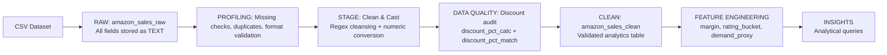

# Amazon Sales Data Cleaning & Transformation (PostgreSQL)

## Project Overview

This project demonstrates an end-to-end SQL data cleaning and transformation workflow using PostgreSQL and reflects production-style ETL structuring with explicit validation, audit logic, and analytical feature engineering.

The goal is to simulate a real-world data engineering pipeline by transforming a raw Amazon sales dataset into an analytics-ready dataset using a structured:

Raw → Stage → Clean → Feature Engineering → Insights

architecture.

---

## Architecture Diagram


---

## Tools Used

- PostgreSQL
- pgAdmin
- SQL
- VS Code
- GitHub 

---
## Dataset Summary

The original CSV dataset is included in the `/DATA` folder to allow full project reproducibility. 

- Raw rows ingested: **1,465**
- Clean rows produced: **1,465**

The dataset includes:

- Product information
- Pricing
- Discount percentage
- Ratings
- Review text

Raw data fields were intentionally stored as 'TEXT' to simulate real-world messy ingestion.

---

# Project Architecture

---

## 1️⃣ Raw Layer

**Purpose:** Ingest unmodified CSV data.

- Schema created (`amazon`)
- Raw table created (`amazon_sales_raw`)
- CSV successfully imported
- Row count verified


---

## 2️⃣ Profiling Layer

Performed exploratory checks to identify data quality issues:

- Missing value checks
- Category distribution analysis
- Duplicate checks
- Basic price validation


---

## 3️⃣ Stage Layer (Transformation & Validation)

**Purpose:** Clean and standardize raw data before production use.

### Transformations Applied

- Created `amazon_sales_stage`
- Standardized text fields
- Removed non-numeric characters from price fields
- Added numeric columns:
  - `discounted_price_num`
  - `actual_price_num`
  - `discount_percentage_num`
  - `rating_num`
  - `rating_count_num`
- Casted values to proper numeric types
- Applied rating (0–5) validation
- Applied price (> 0) validation


---

## 4️⃣ Discount Recalculation & Audit Layer (Data Quality Control)

To ensure pricing accuracy, a validation layer was implemented within the Stage table.

### Enhancements Implemented

- Added `discount_pct_calc` column
- Recalculated discount percentage using numeric price fields
- Added `discount_pct_match` boolean audit flag
- Applied ±0.5 tolerance threshold for validation

### Validation Formula

```
((actual_price_num - discounted_price_num) / actual_price_num) * 100
```

### Audit Results

- **Total Records:** 1,465
- **Matches:** 1,465
- **Mismatches:** 0
- **Not Comparable:** 0

All discount percentages matched the recalculated values within tolerance, confirming full pricing integrity across the dataset.


This audit layer simulates real-world data quality validation performed in production ETL pipelines.

---

## 5️⃣ Clean Layer (Analytics-Ready Table)

**Purpose:** Create a production-ready table for downstream reporting and business intelligence.

The Clean table:

- Uses validated numeric fields from Stage
- Standardizes product and category formatting
- Removes invalid or null pricing records
- Provides consistent column naming for analytics

### Clean Table Row Count

- Rows in clean table: **1,465**


The dataset is now fully validated and ready for analytics, BI dashboards, or feature engineering.

---

## 6️⃣ Feature Engineering (Business Logic Layer)

**Purpose:** Enhance the clean dataset with analytical features for downstream BI and reporting.

Three business logic columns were added to `amazon_sales_clean`:

### 1 Margin
Calculated as: 

```
actual_price - discounted_price
```

---

### 2 Rating Bucket 
Categorizes product ratings into standardized performance tiers:

- Excellent (>= 4.5)
- Good (>= 4.0)
- Average (>= 3.0)
- Poor (< 3.0)
- Unrated (NULL)

This enables grouped analysis of product performance. 

---

### 3 Demand Proxy 
Calculated as: 
```
discounted_price * rating_count
```

This is a simplified interest metric used to approximate product demand intensity (not actual revenue).


The dataset now includes engineered features suitable for ranking, segmentation, and BI dashboard integration. 

---

## 7️⃣ Insights & Analytical Queries

**Purpose:** Demonstrate how the cleaned and feature-engineered dataset can be used for business analysis.

Three example insight queries were created: 

### 1 Top Categories by Demand Proxy

Identifies categories generating the highest overall interest using the engineered demand_proxy metric. 

### 2 Top products by Rating Count (Popularity)

Highlights the most-reviewed products as a proxy for product popularity. 

### 3 Highest Average Margin Categories 

Analyzes pricing spread by category to identify where discount margins are strongest. 


These queries demonstrate how the dataset transitions from raw ingestion to business-ready analytical output. 

This final layer illustrates how structured data engineering enables meaningful business intelligence and decision support. 

---

# Project Status

🟢 **Project Complete - Full data pipeline implemented.**

Pipeline Layers Implemented:

- Raw ingestion
- Profiling
- Stage transformation
- Discount validation audit
- Clean analytics table
- Feature engineering 
- Business insight queries

The dataset is fully validated, feature-enhanced, and analytics-ready. 